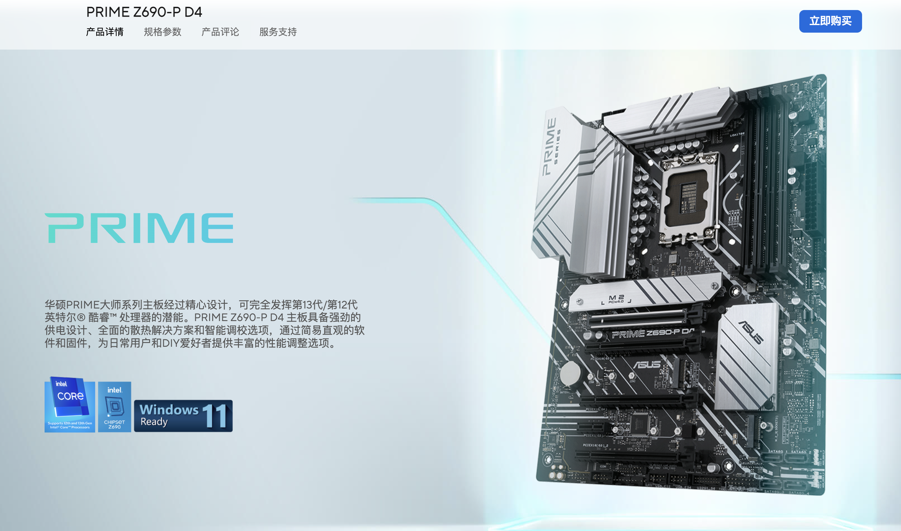
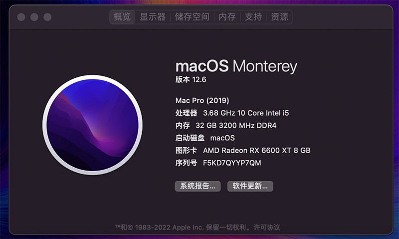
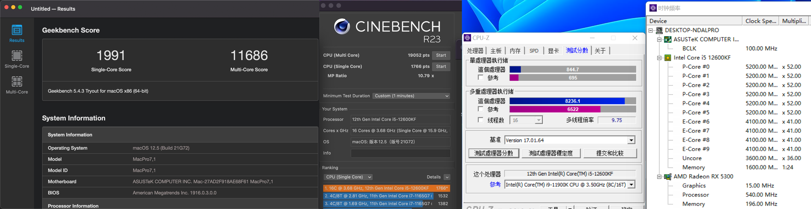
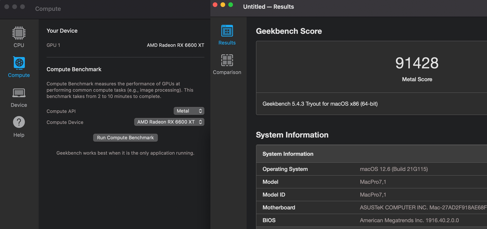
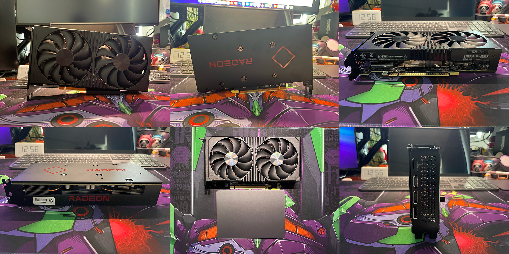

# ASUS-PRIME-Z690-P-D4 Hackintosh OpenCore EFI

### OpenCore

[OpenCore 0.9.7](https://github.com/acidanthera/OpenCorePkg)

### OS Version Tested

- macOS Monterey 12.x
- macOS Ventura  13.x 

### Hardware

- Motherboard:ASUS-PRIME-Z690-P-D4
- Bios Version: PRIME Z690-P D4 BIOS 2014（2022-10-19）
- CPU: Intel i5-12600KF
- RAM: Asgard Freyr 32GB(8G*4) DDR4 3200MHz
- SSD: 1.HIKSEMI C4000 CEO PCIe 4.0 512G MacOS
- SSD: 2.HIKVISON CRIUS C2000 PRO PCIe 3.0 1TB Windows11 (250G) + APFS MacOS DATA DISK
- GPU: HP OEM RX6600XT 8GB (From HP ZHAN 99 DESKTOP)
- Audio: Realtek ALC
- Ethernet: Realtek  PCle 2.5GbE Family Controller
- Wireless: BCM943602CS
- CPU Cooling：MAG CORELIQUID 360R BLACK + be quiet! Light Wings 120mm PWM RGB * 3
- Display: DELL U2718Q + ViewSonic 24VX2478-4K-HD
- PSU: CoolerMaster GX650 BLACK
- CASE: SAMA Versailles 3 With DIY
- CASE Cooling: be quiet! Light Wings 120mm PWM RGB * 3 (Top *2 Back *1)
- InputDevice: Logitech MX Keys + MX Master 2S + Apple Magic Trackpad 2 Grey

### Bios Setup

| Name | Option |
| ----- | --- |

### Notes

 - Use [OpenCore Configurator](https://mackie100projects.altervista.org/opencore-configurator/) build your SMBIOS

 - U must use [RU.efi](RU.efi) Unlock `CFG LOCK` Before Hackintosh,U can watch my [video](https://www.bilibili.com/video/BV1LV4y1N7jF).

### ScreenShot 

- About This Mac

- Geekbench5 + Cinebench R23 + CPU-Z Score i5-12600KF 

- Geekbench5 Score Metal HP OEM RX6600XT 8GB

- HP OEM RX6600XT 8GB

- SAMA Versailles 3 With DIY

### Contact Us

QQ Group: 23304408

